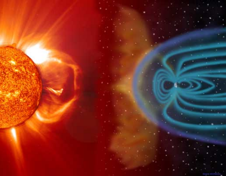

  

<h3 align="center">Space Weather Impact Tool for Power Grids</h3>

---

 This is the repository for the Space Weather Impact Tool for Power Grids. There are three main folders. Electric Field Calculator contains the magnetic field predictor, the electric field calculator, and the solar storm data scraper. The GIC and TTC folder contains the geomagnetically induced current (GIC) calculator as well as the transformer thermal capacity (TTC) estimator. GUI contains the graphical user interface as well as the central part of the system that will call each subsystem when needed.
      

## 📝 Table of Contents

- [About](#about)
- [Getting Started](#getting_started)
- [Authors](#authors)
- [Acknowledgments](#acknowledgement)

## 🧐 About 

The purpose of this project is to develop a tool that can assist electrical grid operators when there is a solar storm. The goal is to predict the effects that in incoming solar storm will have on the power grid so that operators can respond ahead of time instead of responding only in real time. To do this, the solar storm data is gathered from NOAA's website from the DISCOVR satellite at the L1 Lagrange point. This data is used with Tysganenko's TS05 model to predict what the surface magnetic fields will be. With this data, the surface electric fields can be calulated which will then allow the GICs to be calculated and the transformer heating. All of this information will then be displayed to the user in a GUI.

## 🏁 Getting Started 

### Installing

To use this code, download it from GitHub and execute pip install requirements.txt in your virtual environment.

## 🔧 Running the tests 

To test the system, run the associated test bench file.
For the Electric Field Calculator, comment out the three lines of code noted in the ElectricFieldPredictor.py file. Then run Electric_field_calculator_test_bench.py. This will test the Magnetic Field to Electric Field calculation and verify that the earth response is calcuated correctly with the 1D Quebec model. The paper that was used to do this is referneced within the code.

To see the test results of the MagneticFieldPrediction. Just run the Tysganenko_model_test_bench.py file with the B_field_prediction_2015_tsgk.csv file in the same directory. This file compares calcualted data with the predicted data from the same model on NASA's website. The data was collected and combined in this csv file. There is no way to see the test directly on the code becasue the data from NASA and the date output from the code are in significantly different formats so much data processing had to be done to format such that the data could be compared.

The NOAASolarStormDataMiner.py is easy to test. Just call it with the information described in the parent function and it will return the data from NOAA. 

To test the Transformer Thermal Capacity script, simply run the code and input the desired transformer model when prompted. The resulting plot can be compared to those in the EPRI study referrenced below. Similarly for the GIC solver, the code can be run and the results of the calculations will be printed to the terminal along with messages from the associated validation tests.

To test GUI and core, simply run GUI.py, click Load Grid File > Polish_Grid > Polish_grid.AUX. Once the grid is loaded, it can be explored by zooming in (%50-%100 is recommended) and clicking on substation squares to navigate to the substation view, and from the bus buttons can be clicked to enter bus views. The back button returns to the previous view. Additionally, a simulation can be started, but may take a minute to initialize the first time.

## ✍️ Authors 

- [@scriptedfire](https://github.com/scriptedfire) - GUI and core
- [@KMMasters](https://github.com/KMMasters) - GIC and TTC
- [@stephenhurt99](https://github.com/stephenhurt99) - Electric Field Calculator and NOAA data miner

See also the list of [contributors](https://github.com/scriptedfire/blueeye1_capstone/graphs/contributors) who participated in this project.

## 🎉 Acknowledgements 

- References

  D. H. Boteler, R. J. Pirjola and L. Marti, "Analytic Calculation of 
  Geoelectric Fields Due to Geomagnetic Disturbances: A Test Case," 
  in IEEE Access, vol. 7, pp. 147029-147037, 2019, doi: 10.1109/ACCESS.2019.2945530.

  N. A. Tsyganenko and M. I. Sitnov, Modeling the dynamics of the inner magnetosphere during
  strong geomagnetic storms, J. Geophys. Res., v. 110 (A3), A03208, doi: 10.1029/2004JA010798, 2005
  
  Transformer Thermal Impact Assessments for DC Withstand Capability: 
  Examining the Impacts of Geomagnetically Induced Current (GIC) on Transformer Thermal Performance. 
  EPRI, Palo Alto, CA: 2019. 3002017708.
  
  Magnetohydrodynamic Electromagnetic Pulse Assessment of the Continental U.S. Electric Grid: 
  Geomagnetically Induced Current and Transformer Thermal Analysis. 
  EPRI, Palo Alto, CA: 2017. 3002009001.
  
  Horton, Randy & Boteler, David & Overbye, Thomas & Pirjola, Risto & Dugan, Roger. (2012). 
  A Test Case for the Calculation of Geomagnetically Induced Currents. 
  Power Delivery, IEEE Transactions on. 27. 2368-2373. 10.1109/TPWRD.2012.2206407. 
  
  Boteler, David & Pirjola, Risto. (2016). 
  Modelling Geomagnetically Induced Currents. 
  Space Weather. 15. 10.1002/2016SW001499. 
  
  Application Guide: Computing Geomagnetically-Induced Current in the Bulk-Power System.
  NERC: North American Electric Reliability Corporation, 
  nerc.com/comm/PC/Geomagnetic Disturbance Task Force GMDTF 2013/GIC Application Guide 2013_approved.pdf. 
